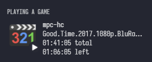

# mpcrp

> A cross-platform discord rich presence integration for mpc-hc 🎬

[](https://github.com/x6r/mpcrp/releases)
[](https://github.com/x6r/mpcrp/actions)
[](https://goreportcard.com/report/github.com/x6r/mpcrp)



## Installation

### Binaries

Download a binary from the [releases](https://github.com/x6r/mpcrp/releases)
page.

### Build from source

Go 1.16 or higher required. ([install instructions](https://golang.org/doc/install.html))

    go install github.com/x6r/mpcrp@latest

## Usage

> **Warning** you have to enable the web interface in mpc-hc for mpcrp to work

```sh
mpcrp &
```

`mpcrp -h` for more info.

### Flags

- `-p`, `--port`: mpc-hc port to connect to _(default: 13579)_
- `-i`, `--id`: discord app id providing rich presence assets _(default: 955267481772130384)_
- `-r`, `--raw`: display only the filename without fanart or filename-parsed metadata
- `--nocover`: attempt to parse filename for metadata without fanart

## Disclaimer

Media and fanart detection is done through the [fanart.tv](https://fanart.tv) api. mpcrp might display irrelevant data, as it is impossible to 100% identify the correct media based on the filename alone.

> eg: a video named _cat.mp4_ will be assumed to be [Cat Planet Cuties](https://fanart.tv/series/173301/cat-planet-cuties/) as it is the first entry on fanart.tv that has a poster and is a tv show or a movie.

If fanart.tv does not recognize the filename, mpcrp will only display the filename along with basic metadata.

## License

[ISC](LICENSE)
